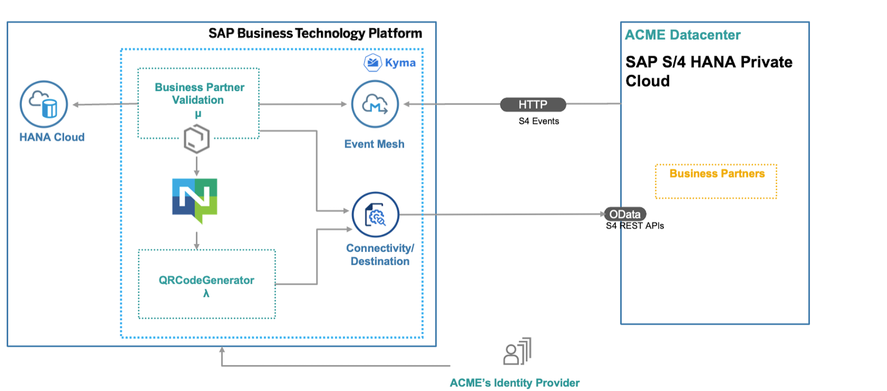

# SAP S/4HANA Extend Business Process Scenario in SAP BTP, Kyma Runtime
## Description

The main intent of this scenario is to complement an existing business process in an SAP solution – currently SAP S/4HANA with additional business process steps. This involves adding major logic and additional data and goes beyond simple UI changes.

This application showcases:

- Building applications on SAP Business Technology Platform (SAP BTP) using [SAP Cloud Application Programming Model (CAP)](https://cap.cloud.sap/docs/)
- Consuming events from SAP S/4HANA on-premise using [SAP Event Mesh](https://help.sap.com/viewer/bf82e6b26456494cbdd197057c09979f/Cloud/en-US/df532e8735eb4322b00bfc7e42f84e8d.html)
- Consuming REST APIs from SAP S/4HANA on-premise using SAP BTP Platform Connectivity Service
- Building and deploying a function in [SAP BTP Kyma Runtime, Serverless](https://kyma-project.io/docs/components/serverless)

We also have a Discovery center mission on [Extend SAP S/4HANA Business Processes on SAP BTP, Kyma Runtime](https://discovery-center.cloud.sap/missiondetail/3586/3629/) using this reference application. 

## Business Scenario

A business scenario is used to showcase how to build a SAP S/4HANA on-premise extension application on SAP BTP, Kyma runtime.

John, who is an employee of Business Partner Validation Firm iCredible, which is a third-party vendor of ACME Corporation, would like to get notifications whenever new Business Partners are added in the SAP S/4HANA backend system of ACME Corporation. John would then be able to review the Business Partner details in his extension app. He would proceed to visit the Business Partner’s registered office and do some background verification. John would then proceed to update or validate the verification details into the extension app. Once the details are verified, the Business Partner gets activated in the SAP S/4HANA system of ACME Corporation.

The scenario covers:

- Custom extension application that works independently from SAP S/4HANA

- Changes in SAP S/4HANA communicated via events in real time to extension application

- Compute intensive processing available on demand (using serverless)

- Vendor personnel needs access to only custom app

## Architecture

### Solution Diagram

The Business Partner Validation application is developed using CAP and runs on the SAP BTP, Kyma runtime. It consumes platform services like SAP Event Mesh, SAP HANA and Connectivity. The events occuring in SAP S/4HANA on-premise are inserted into the SAP Event Mesh queue. The application running in Kyma is notified on events, consumes them from the queue and inserts the event data into the SAP HANA database. The Business Partner Validation Application uses SAP S/4HANA REST API's to read additional Business Partner Data from the SAP S/4HANA system. in a next step, the Business Partner Validation App uses an event-driven approach as well by firing events that get consumed by Serverless Function which posts the relevant business partner data to SAP S/4HANA on-premise system using SAP S4/HANA OData api's.

## Requirements

* SAP S/4HANA on-premise system
* SAP BTP account

### Prerequisites

* [Node.js](https://nodejs.org/en/download/)
* [kubectl command line tool]( https://kubernetes.io/docs/tasks/tools/install-kubectl-windows/)
* [Visual Studio Code](https://cap.cloud.sap/docs/get-started/in-vscode)
* [cds-dk](https://cap.cloud.sap/docs/get-started/)
* [SQLite ](https://sqlite.org/download.html)
* [Docker](https://www.docker.com/products/docker-desktop)
* Get the required [tools](https://cap.cloud.sap/docs/guides/deployment/deploy-to-kyma#prerequisites) as mentioned in the CAP documentation

### Entitlements

The application requires the following set of [Entitlements and Quotas](https://help.sap.com/products/BTP/65de2977205c403bbc107264b8eccf4b/00aa2c23479d42568b18882b1ca90d79.html?locale=en-US) in the SAP BTP cockpit:

| Service                           | Plan               | Number of Instances |
|-----------------------------------|------------------- |:-------------------:|
| SAP HANA Schemas & HDI Containers | hdi-shared         |          1          |
| SAP HANA Cloud                    | tools              |  Subscription       |
| SAP HANA Cloud                    | hana               |          1          |
| Event Mesh                        | default            |          1          |
| Kyma runtime                      |                    |          1          |
| Connectivity Service              | connectivity_proxy |          1          |
| SAP Build Work Zone               | standard/free      |  Subscription       |

## Configuration

### Step 1: [SAP S/4HANA Enable OData Service for Business Partner](./documentation/set%20up/s4h-setup/README.md)

### Step 2: [Setup Connectivity between SAP S/4HANA System, SAP BTP](./documentation/set%20up/connectivity/README.md)

### Step 3: Build and Deploy the CAP Application
- [Configure Your Global Account and Subaccounts in SAP BTP ](./documentation/set%20up/configure-account/README.md)
- [Configure Command Line Tool kubectl](./documentation/set%20up/kubeconfig-setup/README.md)
- [Create an SAP HANA Cloud Instance](./documentation/set%20up/hana/README.md)
- [Deploy the Application to SAP BTP Kyma Runtime](./documentation/deploy/README.md)

### Step 4: [Configure Event-Based Communication between SAP S/4HANA and SAP Event Mesh](./documentation/deploy/configure-channel/README.md)

## Demo Script
   
1. To start your Business Partner Validation Application go to **Instances and Subscriptions**.
2. Find **SAP Build Work Zone** and click to open the application.
3. On the website, find your created website and click on the tile to open it.
4. Click on the **Business Partner Validation** tile.

5. The list of Business Partners along with their **Verification Status** gets displayed. 

6. Log in to the SAP S/4HANA on-premise system.

7. Enter the transaction code **bp**.

8. Choose **Person**.

9. Provide **First name** and **Last name** for the Business Partner.

10. Provide the address.

11. Move to the **Status** tab and check mark the **Central Block** lock. Choose **Save** to create the new Business Partner. 

12. Now go back to the **Business Partner Validation** application to see if the new Business Partner appears on the UI.

13. Go to the details page for the new Business Partner. Choose **Edit**.

14. Change the Verification Status to **Verification Status: VERIFIED**. You can also edit the street name, postal code also if needed. Save the data. 

15. Open SAP S/4HANA system, bp transaction. Search for the newly created **BusinessPartner**.

16. Double click on the Business Partner.

17. You can see that the **Central Block** lock has been removed. 

18. The serverless application has also uploaded a QR code for the address details of the Business Partner to the SAP S/4HANA system. 
You can view this by clicking on the arrow icon in the top left corner. You will have to give permission for downloading the image. 

19. You can also notice that in the Business Partner Validation UI, the status is now set as **COMPLETED**.

## Known Issues

No known issues.

## How to Obtain Support

In case you find a bug, or you need additional support, please open an issue here in [GitHub](https://github.com/SAP-samples/btp-s4hana-kyma-business-process-extension/issues).

## License

Copyright (c) 2022 SAP SE or an SAP affiliate company. All rights reserved. This project is licensed under the Apache Software License, version 2.0 except as noted otherwise in the [LICENSE](LICENSE) file.
