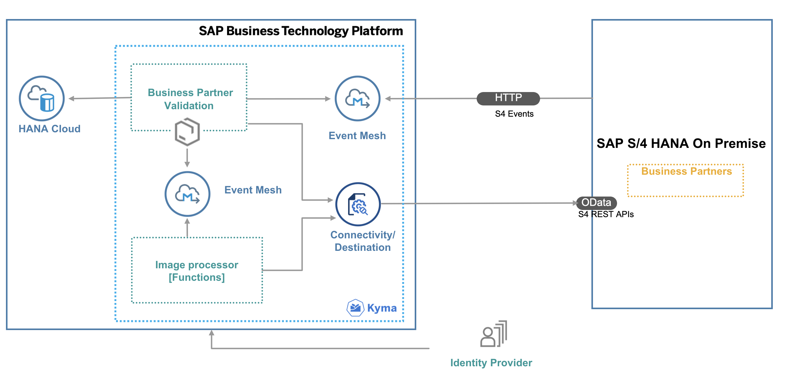

<!-- # TODO: add the final title of the mission used in DC

> Note: The content of this GitHub repository has been created as source for the SAP Discovery Center Mission [tbd](tbd). So we recommend using directly the mission in the SAP Discovery Center.
-->

## Description

The main intent of this scenario is to complement an existing business process in an SAP solution – currently SAP S/4HANA with additional business process steps. This involves adding major logic and/or additional data and goes beyond simple UI changes.

The application showcases:

- Building applications on SAP Business Technology Platform (SAP BTP) using [SAP Cloud Application Programming Model (CAP)](https://cap.cloud.sap/docs/)
- Consuming events from SAP S/4HANA on-premise using [SAP Event Mesh](https://help.sap.com/viewer/bf82e6b26456494cbdd197057c09979f/Cloud/en-US/df532e8735eb4322b00bfc7e42f84e8d.html)
- Consuming REST APIs from SAP S/4HANA on-premise using SAP BTP Platform Connectivity Service
- Building and deploying a function in [SAP BTP Kyma Runtime](https://help.sap.com/docs/BTP/65de2977205c403bbc107264b8eccf4b/468c2f3c3ca24c2c8497ef9f83154c44.html)

## Business Scenario

A business scenario is used to showcase how to build an SAP S/4HANA on-premise extension Application on SAP BTP, Kyma runtime.

John, who is an employee of Business Partner Validation Firm iCredible, which is a third-party vendor of ACME Corporation, would like to get notifications whenever new Business Partners are added to the SAP S/4HANA backend system of ACME Corporation. John would then be able to review the Business Partner details in his extension app. John would proceed to visit the Business Partner’s registered office and do some background verification. John would then proceed to update/validate the verification details into the extension app. Once the details are verified, the Business Partner gets activated in the SAP S/4HANA system of ACME Corporation.

Scenario details:

- Custom extension application that works independently from SAP S/4HANA
- Changes in SAP S/4HANA are communicated via events in real time to the extension application
- Compute intensive processing available on demand (serverless environment)
- Vendor personnel needs access to custom app only

## Solution Architecture

The Business Partner Validation application is developed using the SAP Cloud Application Programming Model (CAP) and runs on the SAP BTP, Kyma runtime. It consumes platform services like SAP Event Mesh, SAP HANA Cloud, and Connectivity. The events occurring in SAP S/4HANA on-premise are inserted into the SAP Event Mesh queue. The application running in Kyma is notified of events, consumes them from the queue and inserts the event data into the SAP HANA Cloud database. The Business Partner Validation Application uses SAP S/4HANA REST APIs to read additional Business Partner Data from the SAP S/4HANA system. In the next step, the Business Partner Validation App uses an event-driven approach as well by firing events that get consumed by Serverless Application, which posts the relevant business partner data to SAP S/4HANA on-premise system using SAP S/4HANA OData APIs.

## Requirements

You can find all requirements to execute the tutorial in section [Prerequisites and Required Systems](../../prepare/prerequisites/README.md).

## Known Issues

The tutorial is provided on the "as-is" basis. Currently, there are no known issues for the tutorial project.

## How to Obtain Support

Create an issue to get support or to report a bug in [GitHub](https://github.com/SAP-samples/btp-s4hana-kyma-business-process-extension/issues).

## License

Copyright (c) 2022 SAP SE or an SAP affiliate company. All rights reserved. This file is licensed under the Apache Software License, version 2.0 except as noted otherwise in the [LICENSE](../../../LICENSES/Apache-2.0.txt) file.
