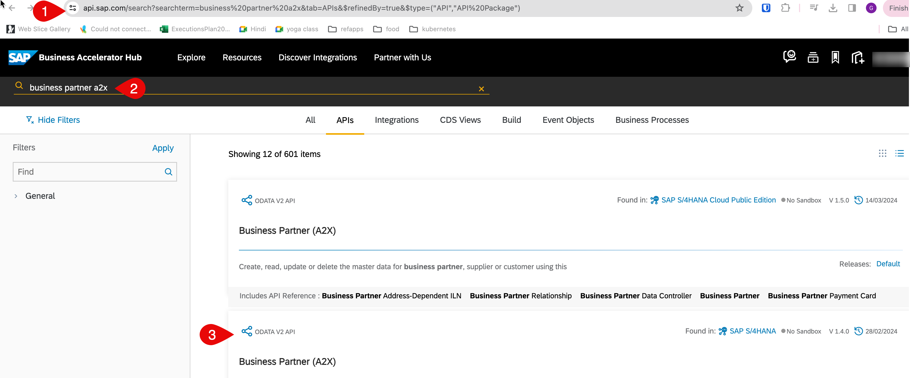
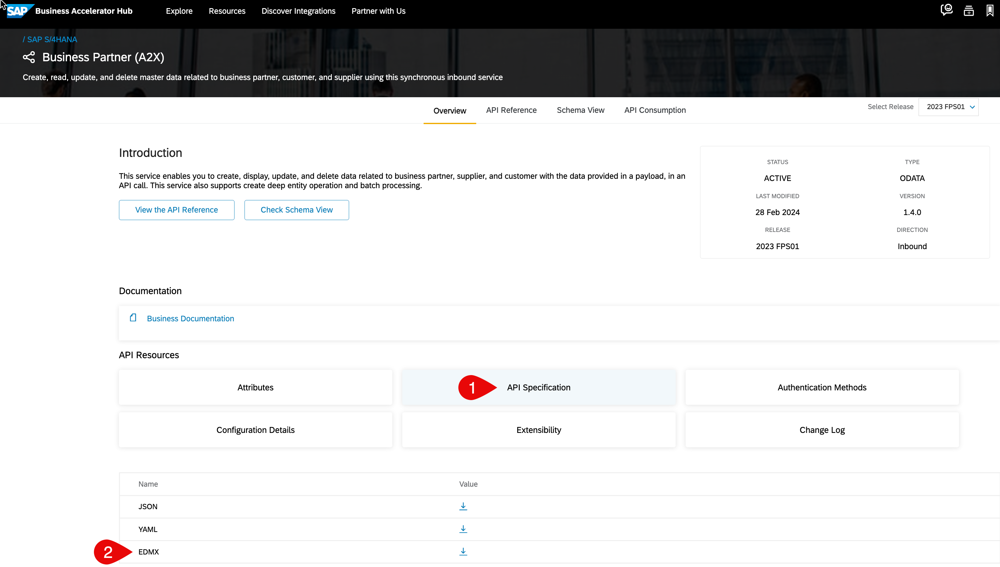

# Download Business Partner API in SAP API Business Hub

## Introduction

You will look up the required API on SAP API Business Hub and download its specification as an EDMX file.

**Persona:** SAP BTP Developer

### Find and Download the API

1. Open the API Business Hub at: https://api.sap.com/

2. Enter **Business Partner** in the search tab.

3. Choose **Search**.

4. Choose **Business Partner (A2X)**.

 

5. Scroll down to **API Resources** and choose **API Specification**.

6. Choose **EDMX** and click on the icon to download.

 
