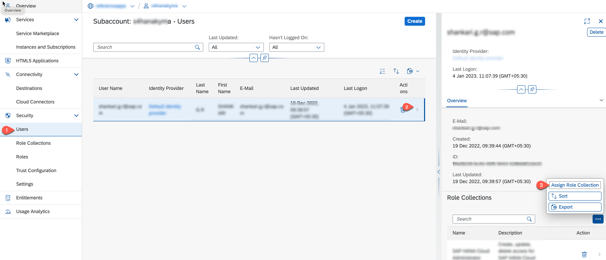
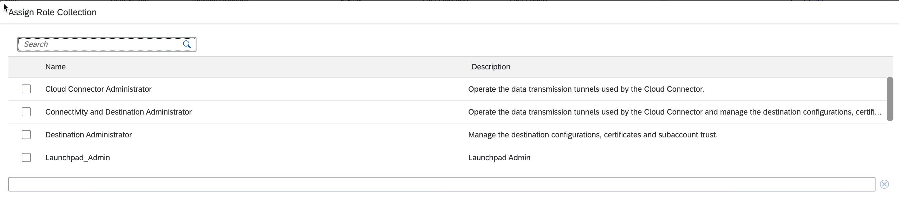

# Configure Your Global Account and Subaccounts in SAP BTP

In this section, you will set up the subaccount in SAP BTP for developing the SAP S/4HANA Kyma extension application.

**Prerequisite:** You must have an administrator role for SAP BTP.

1. Log in to the SAP BTP cockpit and select your global account.

2. In the **Account Explorer**, choose **Create** &rarr; **Subaccount**.

   

3. In the **Create Subaccount** wizard, enter the following values:

   *  In the **Display Name** field, enter your subaccount name.
   *  In the **Subdomain** field, enter your subdomain ID.
   *  In the **Region** field, select the Cloud Foundry region of your choice: Amazon Web Service, Google Cloud Platform or Microsoft Azure.
   *  In the **Parent** field, select your global account.

      

   * For categorizing your subaccount you can add some labels. Choose **Create**.

4. Add entitlements:

   1. Choose **Entitlements** &rarr; **Configure Entitlements** &rarr; **Add Service Plan**.
   

   2. Search for **Kyma Runtime** and select the respective plan.

   

   3. Search for **SAP HANA Cloud** and select the **tools (Application)** service plan. 

   

   4. Do the same for the following services:

      - 'SAP HANA Schemas & HDI container' ->Select Available Plans -> "hdi-shared"
      - 'Event Mesh' -> Select Available Service Plans -> "default"
      - 'Connectivity Service' -> Select Available Service Plans -> "proxy"
      - 'SAP Build Work Zone' -> Select Available Service Plans -> "standard"

   5. Choose **Add 6 Service Plans**.

   6. Choose **Save**.

5. Enable the Kyma environment:

   

   1. In the **Plan** field, select **standard**.
   2. Choose **Create**.

6. To add additional users to the subaccount, choose **Security** &rarr; **Users** and choose **Create**.

   

7. In the **User Name** field, enter the user ID in the selected identity provider.

   

8. Assign the relevant subaccount roles to the users.

      1. Choose **Security** &rarr; **Users** and **Assign Role Collection**:

         

      2. Select the required Role Collections and click on **Assign Role Collection**

         

9. Enable SAP Build Work Zone Subscription:
    
    1. In SAP BTP cockpit navigate to the **Services** &rarr; **Instances and Subscriptions** and choose **create**.

    

    2. In the **service** field choose **SAP Build Work Zone**.
    3. In the **Plan** choose **standard**.
    4. Choose **Create**.

    

10. Enable SAP HANA Cloud Subscription:

    1. In SAP BTP cockpit navigate to the **Services** &rarr; **Instances and Subscriptions** and choose **create**.
    2. In the **service** field choose **SAP HANA Cloud**.
    3. In the **Plan** choose **tools**.
    4. Choose **Create**.

11. Assign *SAP HANA Cloud Administrator* role collection to the users. Refer to Step 8 to do the same.

11. Assign *Launchpad_Admin* role collection to the users. Refer to Step 8 to do the same.

