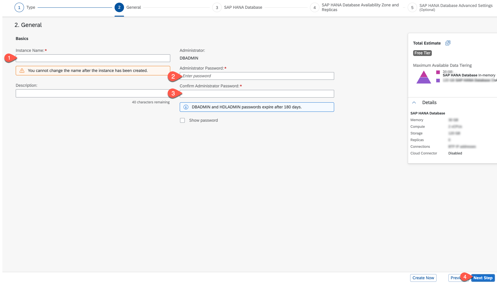

# Create an SAP HANA Cloud Instance

For this mission, we will SAP HANA Cloud as our persistence layer.
Use the following steps to create an SAP HANA Cloud instance on SAP BTP:

1. Navigate to SAP HANA Cloud Subscription Application:

    1. In SAP BTP cockpit navigate to the **Services** &rarr; **Instances and Subscriptions** and **SAP HANA Cloud**.
    2. Select the three dots and choose **Go to Application**.

    

2. In the SAP BTP cockpit, enter the space you have created in the previous tutorial.

3. Select the **SAP HANA Cloud** section and choose **Create** and in the dropdown then select **SAP HANA Database**.

    

4. You will be logged in to SAP HANA Cloud Central. Choose the type of SAP HANA Cloud instance as **SAP HANA Cloud, SAP HANA Database** and select **Next Step**.

   

5. In the next tab, choose the SAP BTP **Organization** and **Space** from the dropdown box. Enter an **Instance name**, also enter a valid database **Administrator Password**, and select **Next Step**.

   

6. Select the **Memory** and **Storage** capacity for your SAP HANA Cloud database instance. For this mission, you can choose the minimum capacity and select **Next Step**.

   

7. In the tab for Availability Zone and Replicas, you can leave the defaults and choose **Next Step**.

   

8. In the tab for SAP HANA Advanced Settings, choose **Allow all IP Addresses** and choose **Review and Create**.

   

9. Choose **Create Instance** to create an instance of SAP HANA Cloud Database instance.

    

    The creation of the instance will take some minutes.

