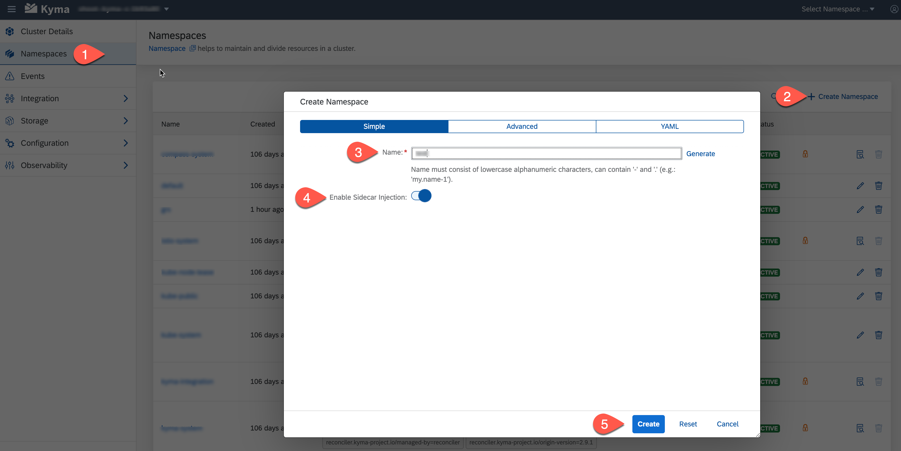

# Configure Command Line Tool *kubectl*

The **kubectl** command line tool lets you control your clusters. You will use it to deploy the application artifacts. But first, you need to provide the details of the cluster.

1. Open the SAP BTP Cockpit and navigate to the overview page of your subaccount, where Kyma is enabled. There you will find the URL to download the kubeconfig file.

   

2. See section [Organizing Cluster Access Using kubeconfig Files](https://kubernetes.io/docs/concepts/configuration/organize-cluster-access-kubeconfig/) in the Kubernetes documentation for more details about the kubeconfig file.

3. Refer [here](https://help.sap.com/docs/BTP/65de2977205c403bbc107264b8eccf4b/3e25944e491049b2aeec68c562a5ee48.html) to access a Kyma Instance using kubectl.

4. Create a namespace:
Either you can create the namespaces using kubectl or using the Kyma dashboard.

Here are the steps using kubectl. Open a shell and run:

   ```shell
   kubectl create namespace <YOUR_NAMESPACE_NAME>
   kubectl label namespace <YOUR_NAMESPACE_NAME> istio-injection=enabled
   ```

Here are the steps using the Kyma Dashboard:

1. Open the Kyma Dashboard and choose **Add new** namespace**. Enter a value in the **Name** field.
2. Switch the toggle button **Enable Sidecar Injection**. 
   
  > Note: Side Car injection must be enabled to run this application.